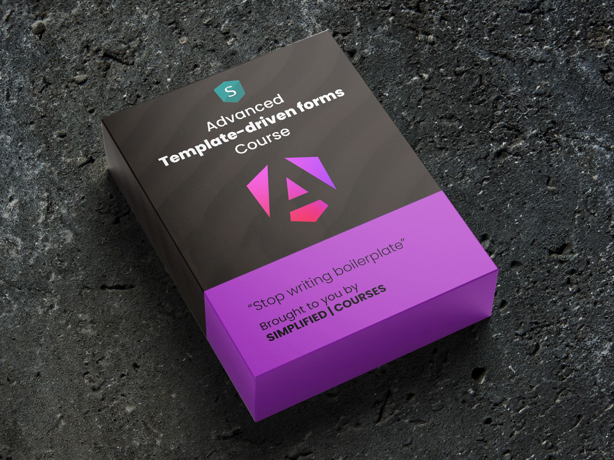

# ngx-vest-forms

### Introduction

This is a very lightweight adapter for Angular template-driven forms and [vestjs](https://vestjs.dev).
This package gives us the ability to create unidirectional forms without any boilerplate.
It is meant for complex forms with a high focus on complex validations and conditionals.

All the validations are asynchronous and use [vestjs](https://vestjs.dev) suites that can be re-used
across different frameworks and technologies.

### Installation

You can install the package by running:

```shell
npm i ngx-vest-forms
```

### Creating a simple form

Let's start by explaining how to create a simple form.
I want a form with a form group called `general` info that has 2 properties:
- `firstName`
- `lastName`

We need to import the `vestForms` const in the imports section of the `@Component` decorator.
Now we can apply the `scVestForm` directive to the `form` tag and listen to the `formValueChange` output to feed our signal.
In the form we create a form group for `generalInfo`  with the `ngModelGroup` directive.
And we crate 2 inputs with the `name` attribute and the `[ngModel]` input.
**Do note that we are not using the banana in the box syntax but only tha square brackets, resulting in a unidirectional dataflow**

```typescript
import { vestForms, DeepPartial } from 'ngx-vest-forms';

// A form model is always deep partial because angular will create it over time organically
type MyFormModel = DeepPartial<{
  generalInfo: {
    firstName: string;
    lastName: string;
  }
}>

@Component({
  imports: [vestForms],
  template: `
<form scVestForm 
      (formValueChange)="formValue.set($event)"
      (ngSubmit)="onSubmit()">
      <div ngModelGroup="generalInfo">
        <label>First name</label>
        <input type="text" name="firstName" [ngModel]="formValue().generalInformation?.firstName"/>
      
        <label>Last name</label>
        <input type="text" name="lastName" [ngModel]="formValue().generalInformation?.lastName"/>
      </div>
</form>
  `
})
export class MyComponent {
  // This signal will hold the state of our form
  protected readonly formValue = signal<MyFormModel>({});
}
```

**Note: Template-driven forms are deep partial, so always use the `?` operator in your templates.**

That's it! This will feed the `formValue` signal and angular will create a form group and 2 form controls for us automatically.
The object that will be fed in the `formValue` signal will look like this:

```typescript
formValue = {
  generalInfo: {
    firstName: '',
    lastName: ''
  }
}
```

The ngForm will contain automatically created FormGroups and FormControls.
This does not have anything to do with this package. It's just Angular:
```typescript
form = {
  controls: {
    generalInformation: { // FormGroup
      controls: {
        firstName: {...}, // FormControl
        lastName: {...} //FormControl
      }
    }
  }
}
```

The `scVestForm` directive offers some basic outputs for us though:

| Output               | Description                                                                                                                             | 
|----------------------|-----------------------------------------------------------------------------------------------------------------------------------------|
| formValueChange<T>   | Emits when the form value changes. But debounces<br/> the events since template-driven forms are created by the<br/>framework over time | 
| dirtyChange<boolean> | Emits when the dirty state of the form changes                                                                                          | 
| validChange<boolean> | Emits when the form becomes dirty or pristine                                                                                           | 
| errorsChange         | Emits an entire list of the form and all its form groups and controls                                                                   | 

### Avoiding typo's

Template-driven forms are type-safe, but not in the `name` attributes or `ngModelGroup` attributes.
Making a typo in those can result in a time-consuming endeavor. For this we have introduced shapes.
A shape is an object where the `scVestForm` can validate to. It is a deep required of the form model:

```typescript
import { DeepPartial, DeepRequired, vestForms } from 'ngx-vest-forms';

type MyFormModel = DeepPartial<{
  generalInfo: {
    firstName: string;
    lastName: string;
  }
}>

export const myFormModelShape: DeepRequired<MyFormModel> = {
  generalInfo: {
    firstName: '',
    lastName: '' 
  }
};

@Component({
  imports: [vestForms],
  template: `
<form scVestForm 
      [formShape]="shape"
      (formValueChange)="formValue.set($event)"
      (ngSubmit)="onSubmit()">
      
      <div ngModelGroup="generalInfo">
        <label>First name</label>
        <input type="text" name="firstName" [ngModel]="formValue().generalInformation?.firstName"/>
      
        <label>Last name</label>
        <input type="text" name="lastName" [ngModel]="formValue().generalInformation?.lastName"/>
      </div>
</form>
  `
})
export class MyComponent {
  protected readonly formValue = signal<MyFormModel>({});
  protected readonly shape = myFormModelShape;
}
```

By passing the shape to the `formShape` input the `scVestForm` will validate the actual form value
against the form shape every time the form changes, but only when Angular is in devMode.

Making a typo in the name attribute or an ngModelGroup attribute would result in runtime errors.
The console would look like this:

```chatinput
Error: Shape mismatch:

[ngModel] Mismatch 'firstame'
[ngModelGroup] Mismatch: 'addresses.billingddress'
[ngModel] Mismatch 'addresses.billingddress.steet'
[ngModel] Mismatch 'addresses.billingddress.number'
[ngModel] Mismatch 'addresses.billingddress.city'
[ngModel] Mismatch 'addresses.billingddress.zipcode'
[ngModel] Mismatch 'addresses.billingddress.country'


    at validateShape (shape-validation.ts:28:19)
    at Object.next (form.directive.ts:178:17)
    at ConsumerObserver.next (Subscriber.js:91:33)
    at SafeSubscriber._next (Subscriber.js:60:26)
    at SafeSubscriber.next (Subscriber.js:31:18)
    at subscribe.innerSubscriber (switchMap.js:14:144)
    at OperatorSubscriber._next (OperatorSubscriber.js:13:21)
    at OperatorSubscriber.next (Subscriber.js:31:18)
    at map.js:7:24
```

### Conditional fields

What if we want to remove a form control or form group? With reactive forms that would require a lot of work 
but since Template driven forms do all the hard work for us, we can simply create a computed signal for that and
bind that in the template. Having logic in the template is considered a bad practice, so we can do all
the calculations in our class.

Let's hide `lastName` if `firstName` is not filled in:

```html
<div ngModelGroup="generalInfo">
  <label>First name</label>
  <input type="text" name="firstName" [ngModel]="formValue().generalInformation?.firstName"/>
  
  @if(lastNameAvailable()){
    <label>Last name</label>
    <input type="text" name="lastName" [ngModel]="formValue().generalInformation?.lastName"/>
  }
</div>
```

```typescript
class MyComponent {
  ...
  protected readonly lastNameAvailable = 
    computed(() => !!this.formValue().generalInformation?.firstName);
}
```

This will automatically add and remove the form control from our form model.
This also works for a form group:

```html
@if(showGeneralInfo()){
  <div ngModelGroup="generalInfo">
    <label>First name</label>
    <input type="text" name="firstName" [ngModel]="formValue().generalInformation?.firstName"/>
    
    <label>Last name</label>
    <input type="text" name="lastName" [ngModel]="formValue().generalInformation?.lastName"/>
  </div>
}
```

### Reactive disabling

To achieve reactive disabling, we just have to take advantage of computed signals as well:

```typescript
class MyComponent {
  protected readonly lastNameDisabled = 
    computed(() => !this.formValue().generalInformation?.firstName);
}
```

We can bind the computed signal to the `disabled` directive of Angular.
```html
<input type="text" name="lastName" 
       [disabled]="lastNameDisabled()" 
       [ngModel]="formValue().generalInformation?.lastName"/>
```

### Validations

The absolute gem in ngx-vest-forms is the flexibility in validations without writing any boilerplate.
The only dependency this lib has is [vest.js](https://vestjs.dev). An awesome lightweight validation framework.
You can use it on the backend/frontend/Angular/react etc...

We use vest because it introduces the concept of vest suites. These are suites that kind of look like unit-tests
but that are highly flexible:
* [X] Write validations on forms
* [X] Write validations on form groups
* [X] Write validations on form controls
* [X] Composable/reuse-able different validation suites
* [X] Write conditional validations

This is how you write a simple Vest suite:
```typescript
import { enforce, only, staticSuite, test } from 'vest';
import { MyFormModel } from '../models/my-form.model'

export const myFormModelSuite = staticSuite(
    (model: MyformModel, field?: string) => {
      if (field) {
        // Needed to not run every validation every time
        only(field);
      }
      test('firstName', 'First name is required', () => {
        enforce(model.firstName).isNotBlank();
      });
      test('lastName', 'Last name is required', () => {
        enforce(model.lastName).isNotBlank();
      });
    }
  );
};
```

In the `test` function the first parameter is the field, the second is the validation error.
The field is separated with the `.` syntax. So if we would have an `addresses` form group with an `billingAddress` form group inside
and a form control `street` the field would be: `addresses.billingAddress.street`.

This syntax should be self-explanatory and the entire enforcements guidelines can be found on [vest.js](https://vestjs.dev).

Now let's connect this to our form. This is the biggest pain that ngx-vest-forms will fix for you: **Connecting Vest suites to Angular**

```typescript
class MyComponent {
  protected readonly formValue = signal<MyFormModel>({});
  protected readonly suite = myFormModelSuite;
}
```

```html

<form scVestForm
      [formShape]="shape"
      [formValue]="formValue"
      [suite]="suite"
      (formValueChange)="formValue.set($event)"
      (ngSubmit)="onSubmit()">
  ...
</form>
```

That's it. Validations are completely wired now. Because ngx-vest-forms will hook into the 
`[ngModel]` and `ngModelGroup` attributes, and create ngValidators automatically.

It goes like this: 
- Control gets created, Angular recognizes the `ngModel` and `ngModelGroup` directives
- These directives implement `AsyncValidator` and will connect to a vest suite
- User types into control
- The validate function gets called
- Vest gets called for one field
- Vest returns the errors
- @simpilfied/forms puts those errors on the angular form control

This means that `valid`, `invalid`, `errors`,  `statusChanges` etc will keep on working
just like it would with a regular angular form.

#### Showing validation errors

Now we want to show the validation errors in a consistent way.
For that we have provided the `sc-control-wrapper` attribute component.

You can use it on:
- elements that hold `ngModelGroup`
- elements that have an `ngModel` (or form control) inside of them.

This will show errors automatically on:
- form submit
- blur

**Note:** If those requirements don't fill your need, you can write a custom control-wrapper by copy-pasting the
`control-wrapper` and adjusting the code.

Let's update our form:

```html

<div ngModelGroup="generalInfo" sc-control-wrapper>
  <div sc-control-wrapper>
    <label>First name</label
    <input type="text" name="firstName" [ngModel]="formValue().generalInformation?.firstName"/>
  </div>

  <div sc-control-wrapper>
    <label>Last name</label>
    <input type="text" name="lastName" [ngModel]="formValue().generalInformation?.lastName"/>
  </div>
</div>
```

This is the only thing we need to do to create a form that is completely wired with vest.
* [x] Automatic creation of form controls and form groups
* [x] Automatic connection to vest suites
* [x] Automatic typo validation
* [x] Automatic adding of css error classes and showing validation messages
  * [x] On blur
  * [x] On submit

### Conditional validations

Vest makes it extremely easy to create conditional validations.
Assume we have a form model that has `age` and `emergencyContact`.
The `emergencyContact` is required, but only when the person is not of legal age.

We can use the `omitWhen` so that when the person is below 18, the assertion
will not be done.

```typescript
import { enforce, omitWhen, only, staticSuite, test } from 'vest';

...
omitWhen((model.age || 0) >= 18, () => {
  test('emergencyContact', 'Emergency contact is required', () => {
    enforce(model.emergencyContact).isNotBlank();
  });
});
```

You can put those validations on every field that you want. On form group fields and on form control fields.
Check this interesting example below:

* [x] Password is always required
* [x] Confirm password is only required when there is a password
* [x] The passwords should match, but only when they are both filled in

```typescript
test('passwords.password', 'Password is not filled in', () => {
  enforce(model.passwords?.password).isNotBlank();
});
omitWhen(!model.passwords?.password, () => {
  test('passwords.confirmPassword', 'Confirm password is not filled in', () => {
    enforce(model.passwords?.confirmPassword).isNotBlank();
  });
});
omitWhen(!model.passwords?.password || !model.passwords?.confirmPassword, () => {
  test('passwords', 'Passwords do not match', () => {
    enforce(model.passwords?.confirmPassword).equals(model.passwords?.password);
  });
});
```

Forget about manually adding, removing validators on reactive forms and not being able to
re-use them. This code is easy to test, easy to re-use on frontend, backend, angular, react, etc...
**Oh, it's also pretty readable**

### Composable validations

We can compose validations suites with sub suites. After all, we want to re-use certain pieces of our
validation logic and we don't want one huge unreadable suite.
This is quite straightforward with Vest.

Let's take this simple function that validates an address:

```typescript
export function addressValidations(model: AddressModel | undefined, field: string): void {
  test(`${field}.street`, 'Street is required', () => {
    enforce(model?.street).isNotBlank();
  });
  test(`${field}.city`, 'City is required', () => {
    enforce(model?.city).isNotBlank();
  });
  test(`${field}.zipcode`, 'Zipcode is required', () => {
    enforce(model?.zipcode).isNotBlank();
  });
  test(`${field}.number`, 'Number is required', () => {
    enforce(model?.number).isNotBlank();
  });
  test(`${field}.country`, 'Country is required', () => {
    enforce(model?.country).isNotBlank();
  });
}
```

Our suite would consume it like this:

```typescript
import { enforce, omitWhen, only, staticSuite, test } from 'vest';
import { PurchaseFormModel } from '../models/purchaseFormModel';

export const mySuite = staticSuite(
  (model: PurchaseFormModel, field?: string) => {
    if (field) {
      only(field);
    }
    addressValidations(model.addresses?.billingAddress, 'addresses.billingAddress');
    addressValidations(model.addresses?.shippingAddress, 'addresses.shippingAddress');
  }
);
```

We achieved decoupling, readability and reuse of our addressValidations.

#### A more complex example

Let's combine the conditional part with the reusable part.
We have 2 addresses, but the shippingAddress is only required when the `shippingAddressIsDifferentFromBillingAddress`
Checkbox is checked. But if it is checked, all fields are required.
And if both addresses are filled in, they should be different.

This gives us validation on:
* [x] The addresses form field (they can't be equal)
* [x] The shipping Address field (only required when checkbox is checked)
* [x] validation on all the address fields (street, number, etc) on both addresses

```typescript
addressValidations(
  model.addresses?.billingAddress,
  'addresses.billingAddress'
);
omitWhen(
  !model.addresses?.shippingAddressDifferentFromBillingAddress,
  () => {
    addressValidations(
      model.addresses?.shippingAddress,
      'addresses.shippingAddress'
    );
    test('addresses', 'The addresses appear to be the same', () => {
      enforce(JSON.stringify(model.addresses?.billingAddress)).notEquals(
        JSON.stringify(model.addresses?.shippingAddress)
      );
    });
  }
);
```

### Validation options

The validation is triggered immediately when the input on the formModel changes.  
In some cases you want to debounce the input (e.g. if you make an api call in the validation suite).

You can configure additional `validationOptions` at various levels like `form`, `ngModelGroup` or `ngModel`. 

```html

<form scVestForm
      ...
      [validationOptions]="{ debounceTime: 0 }">
    ...
    <div sc-control-wrapper>
        <label>UserId</label>
        <input type="text" name="userId" [ngModel]="formValue().userId?"
               [validationOptions]="{ debounceTime: 300 }"/>
    </div>
    ...
</form>
```


### Validations on the root form

When we want to validate multiple fields that are depending on each other,
it is a best practice to wrap them in a parent form group.
If `password`  and `confirmPassword` have to be equal the validation should not happen on
`password` nor on `confirmPassword`, it should happen on `passwords`:

```typescript
const form = {
  // validation happens here
  passwords: {
    password: '',
    confirmPassword: ''
  }
};
```

Sometimes we don't have the ability to create a form group for 2 depending fields, or sometimes we just
want to create validation rules on portions of the form. For that we can use `validateRootForm`.
Use the `errorsChange` output to keep the errors as state in a signal that we can use in the template
wherever we want.

```html
{{ errors()?.['rootForm'] }} <!-- render the errors on the rootForm -->
{{ errors() }} <!-- render all the errors -->
<form scVestForm 
      [formValue]="formValue()"
      [validateRootForm]="true"
      [formShape]="shape"
      [suite]="suite"
      (errorsChange)="errors.set($event)"
      ...>
</form>
```

```typescript
export class MyformComponent {
  protected readonly formValue = signal<MyFormModel>({});
  protected readonly suite = myFormModelSuite;
  // Keep the errors in state
  protected readonly errors = signal<Record<string, string>>({ });
}
```

When setting the `[validateRootForm]` directive to true, the form will
also create an ngValidator on root level, that listens to the ROOT_FORM field.

To make this work we need to use the field in the vest suite like this:

```typescript
import { ROOT_FORM } from 'ngx-vest-forms';

test(ROOT_FORM, 'Brecht is not 30 anymore', () => {
  enforce(
    model.firstName === 'Brecht' && 
    model.lastName === 'Billiet' && 
    model.age === 30).isFalsy();
});
```


### Validation of dependant controls and or groups

Sometimes, form validations are dependent on the values of other form controls or groups.
This scenario is common when a field's validity relies on the input of another field.
A typical example is the `confirmPassword` field, which should only be validated if the `password` field is filled in.
When the `password` field value changes, it necessitates re-validating the `confirmPassword` field to ensure
consistency.

Here's how you can handle validation dependencies with ngx-vest-forms and vest.js:


Use Vest to create a suite where you define the conditional validations.
For example, the `confirmPassword` field should only be validated when the `password` field is not empty.
Additionally, you need to ensure that both fields match.

```typescript
import { enforce, omitWhen, staticSuite, test } from 'vest';
import { MyFormModel } from '../models/my-form.model';

export const myFormModelSuite = staticSuite((model: MyFormModel, field?: string) => {
    if (field) {
        only(field);
    }

    test('password', 'Password is required', () => {
        enforce(model.password).isNotBlank();
    });

    omitWhen(!model.password, () => {
        test('confirmPassword', 'Confirm password is required', () => {
            enforce(model.confirmPassword).isNotBlank();
        });
    });

    omitWhen(!model.password || !model.confirmPassword, () => {
        test('passwords', 'Passwords do not match', () => {
            enforce(model.confirmPassword).equals(model.password);
        });
    });
});
```

Creating a validation config.
The `scVestForm` has an input called `validationConfig`, that we can use to let the system know when to retrigger validations.

```typescript
protected validationConfig = {
    password: ['passwords.confirmPassword']
}
```
Here we see that when password changes, it needs to update the field `passwords.confirmPassword`.
This validationConfig is completely dynamic, and can also be used for form arrays.

```html

<form scVestForm
      ...
      [validationConfig]="validationConfig">
    <div ngModelGroup="passwords">
        <label>Password</label>
        <input type="password" name="password" [ngModel]="formValue().passwords?.password"/>

        <label>Confirm Password</label>
        <input type="password" name="confirmPassword" [ngModel]="formValue().passwords?.confirmPassword"/>
    </div>
</form>
```


#### Form array validations

An example can be found [in this simplified courses article](https://blog.simplified.courses/template-driven-forms-with-form-arrays/)
There is also a complex example of form arrays with complex validations in the examples.


### Child form components

Big forms result in big files. It makes sense to split them up.
For instance an address form can be reused, so we want to create a child component for that.
We have to make sure that this child component can access the ngForm.
For that we have to use the `vestFormViewProviders` from `ngx-vest-forms`

```typescript
...
import { vestForms, vestFormsViewProviders } from 'ngx-vest-forms';

@Component({
  ...
  viewProviders: [vestFormsViewProviders]
})
export class AddressComponent {
  @Input() address?: AddressModel;
}
```

# Examples
to check the examples, clone this repo and run:
```shell
npm i
npm start
```

There is an example of a complex form with a lot of conditionals and specifics,
and there is an example of a form array with complex validations that is used to
create a form to add business hours. A free tutorial will follow soon.


You can check the examples in the github repo [here](https://github.com/simplifiedcourses/ngx-vest-forms/blob/master/projects/examples).
[Here](https://stackblitz.com/~/github.com/simplifiedcourses/ngx-vest-forms-stackblitz){:target="_blank"} is a stackblitz example for you.
It's filled with form complexities and also contains form array logic.

## Want to learn more?
[](https://www.simplified.courses/complex-angular-template-driven-forms)

[This course](https://www.simplified.courses/complex-angular-template-driven-forms) teaches you to become a form expert in no time.
